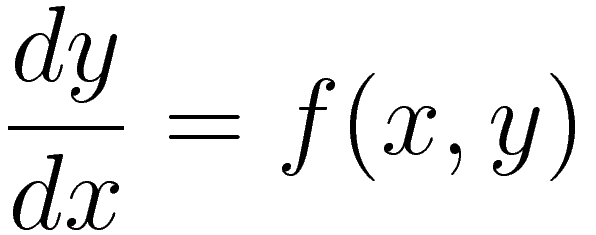

# JScripts
This repository mostly contains scripts, written in JavaScript (JS), for the purpose of scientific computing. Here there be ODE solvers.

## Structure
An example structure for this repository is:

```bash
.
├── lib/
│   └── RK4/
│       ├── 1st-order.js
│       ├── 2nd-order.js
│       └── 3-coupled-1st.js
├── LICENSE
├── math/
│   ├── old/
│   │   ├── RK4-airy.js
│   │   ├── RK4-rosetta.js
│   │   ├── RK4-simpen.js
│   │   └── RK4.js
│   ├── RK4/
│   │   ├── airy.js
│   │   ├── anger.js
│   │   ├── hermite.js
│   │   ├── lorenz.js
│   │   └── rwave.js
│   └── work-in-progress/
│       └── SLE-airy.js
└── README.md
```

The `lib` folder, as one may guess, contains scripts that are used in other scripts (usually because they contain useful functions). The `RK4` subfolder of the `lib` folder contains scripts related to the fourth-order Runge-Kutta Method, although known by the abbreviated RK4. The `1st-order.js` script is for solving equations of the form:



The `2nd-order.js` script is for equations of the form:


## Airy Equation
<script src='https://cdn.mathjax.org/mathjax/latest/MathJax.js?config=TeX-AMS-MML_HTMLorMML'></script>
<script type="text/x-mathjax-config">
MathJax.Hub.Config({
  tex2jax: {inlineMath: [['$','$'], ['\\(','\\)']]}
});
</script>

$$ \frac{d^2 y}{dx^2} = xy $$

## How to use these scripts
In order to use these scripts I recommend you have Git, Node.js and NPM installed and run:

```bash
git clone https://github.com/fusion809/JScripts
cd JScripts
npm install gnu-plot mathjs ode-rk4
```

Then when you want to run a script run it using Node.js, that is, use the command:

```bash
node <SCRIPT>.js
```
